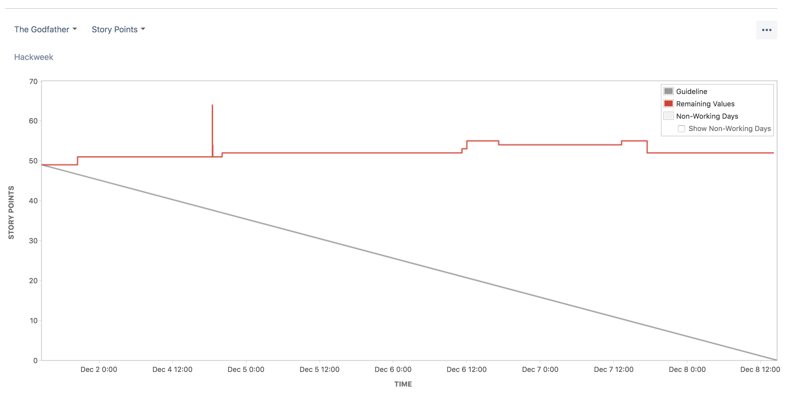
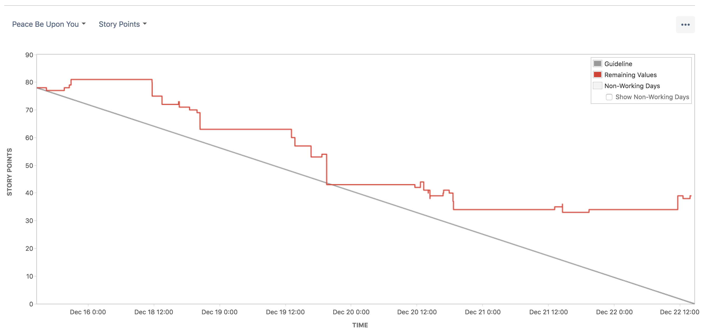
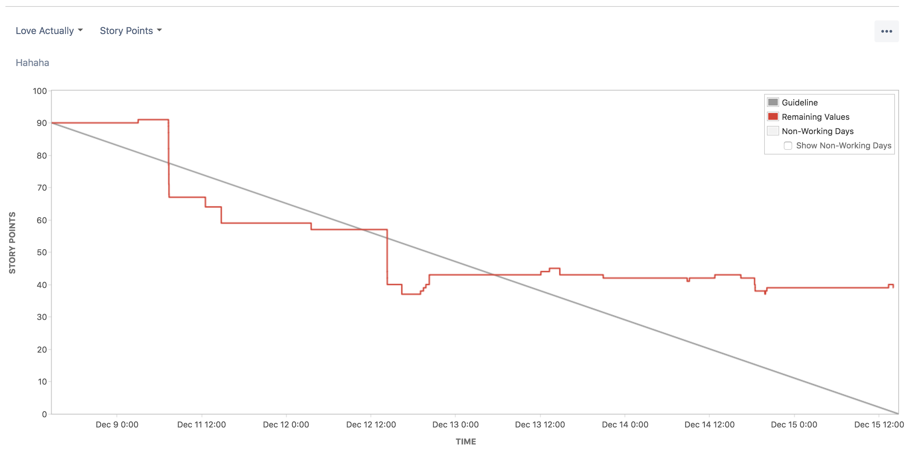

# Infraestructura bajo tu control

## Oscar David Arbeláez

---

## Sobre mi

- Desarrollador full stack @ AdRoll via BairesDev
- [github.com/odarbelaeze](https://github.com/odarbelaeze)

--

### Me apasiona:

- Los contenedores 🐳
- La integración continua
- La entrega continua 🚢 🇮🇹
- La física (MSc. en Física)

--

### No me apasiona:

- Desplegar manualmente
- Lidiar con inestabilidades

---

## Temas

--

### Técnicamente hablando

- Docker 🐳
- Travis CI 🛠
- `docker-compose` 🐳🤔
- `docker swarm` 🐳🐳🐳
- `docker-machine` 🐳🤖

--

### Filosóficamente hablando

- Continous integration
- Continous delivery
- DevOps

---

## Por qué continuous delivery?

--

> CI/CD Es fundamental para la productividad de un equipo.

--

### Mi equipo

- Sprints de 1 semana
- Usualmente no desplegamos los viernes
- Una tarea hecha = 🚢 🇮🇹
- Cada tarea pasa por:
  - Desarrollo
  - Peer review
  - Despliegue a Staging
  - Despliegue a Producción

--

### Antes de adoptar CD



--

### 1 Semana despues



--

### 2 Semanas despues



---

## Qué queremos?

--

### Micro servicios 🐳

--

### Despliegues con zero downtime 🚢

--

### 🙀 Rollbacks con poco esruerzo

--

### Balanceo de carga ⚖️

--

### Escalamiento independendiente...

--

### ...En varios servidores 💻 💻

--

### Archivos de configuracion entendibles 🙏


---

## Ejemplo

--

- 2 Micro servicios
  - 1 UI (React ⚛️)
  - 1 API (Python 🐍)
- 1 Balanceador de carga (docker flow proxy)
- 1 Repositorio para el despliegue
- Desplegados en DigitalOcean

---

## Paso 1: Construir contenedores

--

### API

[github.com/odarbelaeze/infra-quotes](https://github.com/odarbelaeze/infra-quotes)

```dockerfile
FROM python:alpine
ENV GUNICORN_WORKERS 2
ENV GUNICORN_BACKLOG=4096
RUN pip install gunicorn json-logging-py
COPY ./ /src/app
RUN pip install /src/app
EXPOSE 8000
CMD [ \
    "/usr/local/bin/gunicorn", \
    "--config", "/src/app/config/gunicorn.py", \
    "--log-config", "/src/app/config/logger.conf", \
    "-b", ":8000", \
    "quotes.app:APP" \
]
```

--

### UI

[github.com/odarbelaeze/infra-quotes-ui](https://github.com/odarbelaeze/infra-quotes-ui)

```dockerfile
FROM node:carbon-alpine as builder
ADD . /src
WORKDIR /src
ENV NODE_ENV=production
RUN npm install && npm run build

FROM nginx:alpine
COPY config/nginx.conf /etc/nginx/conf.d/default.conf
COPY --from=builder /src/build /code/
EXPOSE 80
```

---

## Paso 2: Enviar los contenedores a un registro

--

### API 🚢 🐳

[hub.docker.com/r/odarbelaeze/quotes/](https://hub.docker.com/r/odarbelaeze/quotes/)

```bash
echo "$DOCKER_PASSWORD" | docker login \
    -u "$DOCKER_USERNAME" --password-stdin

docker tag \
    odarbelaeze/quotes:$TRAVIS_COMMIT \
    odarbelaeze/quotes:latest

docker push odarbelaeze/quotes:$TRAVIS_COMMIT
docker push odarbelaeze/quotes:latest
```

--

### UI 🚢 🐳

[hub.docker.com/r/odarbelaeze/quotes-ui/](https://hub.docker.com/r/odarbelaeze/quotes-ui/)

```bash
echo "$DOCKER_PASSWORD" | docker login \
    -u "$DOCKER_USERNAME" --password-stdin

docker tag \
    odarbelaeze/quotes-ui:$TRAVIS_COMMIT \
    odarbelaeze/quotes-ui:latest

docker push odarbelaeze/quotes-ui:$TRAVIS_COMMIT
docker push odarbelaeze/quotes-ui:latest
```

---

## Paso 3: Docker compose

--

### Describe tus servicios

[github.com/odarbelaeze/infra-production](https://github.com/odarbelaeze/infra-production)

```yaml
version: '3'
services:
  quotes:
    image: odarbelaeze/quotes:6a5c3019debc0b2c1bbeeaabb7df8ba8f53913ed
    environment:
      - QUOTES_PREFIX=/api
    networks:
      - proxy
    deploy:
      replicas: 3
      labels:
        - com.df.notify=true
        - com.df.servicePath=/api
        - com.df.port=8000
```

--

### Dale una probada

 #ItWorksOnMyMachine

```bash
docker swarm init
docker network create --driver overlay proxy
docker stack deploy -c balancer/docker-compose.yml balancer
docker stack deploy -c quotes/docker-compose.yml quotes
```

---

## Paso 4: Construye to infraestructura

--

### `docker-machine`

```bash
docker-machine create \
    --driver digitalocean \
    --digitalocean-image ubuntu-16-04-x64 \
    --digitalocean-ssh-key-fingerprint <...> \
    --digitalocean-ssh-key-path ci/keys/id_rsa \
    --digitalocean-access-token $DOTOKEN \
    manager

docker-machine ssh manager \
    "docker swarm init ..."

docker-machine ssh manager \
    "docker network create --driver overlay proxy"
```

--

### Nota: Worker nodes

- Se pueden crear otras máquinas
- Se pueden conectar con `docker swarm join`
- Docker automaticamente correra servicios en ellas
- Manten el balanceador de carga en el `manager`

--

```bash
docker-machine create \
    --driver digitalocean \
    --digitalocean-image ubuntu-16-04-x64 \
    --digitalocean-ssh-key-fingerprint <...> \
    --digitalocean-ssh-key-path ci/keys/id_rsa \
    --digitalocean-access-token $DOTOKEN \
    slave

docker-machine ssh slave \
    "docker swarm join ..."
```

---

## Paso 5: Despliege 🚢 🇮🇹

--

### Conservaste la IP del servidor 😹

```bash
scp \
    -o "StrictHostKeyChecking no" \
    -i ci/keys/id_rsa \
    -r \
    balancer/ quotes/ \
    root@$SERVER_IP:
ssh \
    -o "StrictHostKeyChecking no" \
    -i ci/keys/id_rsa root@$SERVER_IP \
    'docker stack deploy -c balancer/docker-compose.yml balancer'
ssh \
    -o "StrictHostKeyChecking no" \
    -i ci/keys/id_rsa root@$SERVER_IP \
    'docker stack deploy -c quotes/docker-compose.yml quotes'
```

--

### Disfruta

[http://167.99.57.14/](http://167.99.57.14/)

---

## Notas

--

## 🔧

> Todos estos pasos deben ser ejecutados desde
> un sistema de integración continua.

--

## 🙈

> Los secretos como tokens, claves `SSH` y otros
> que se requieren para el despliegue deben ser
> manipulados de forma segura.

--

## 🤕

> Manejar secretos es un dolor de cabeza.

---

## Operaciones

### Si el tiempo lo permite ⏲

---

# Gracias

Preguntas?

📫 [`odarbelaeze@gmail.com`](mailto://odarbelaeze@gmail.com)
